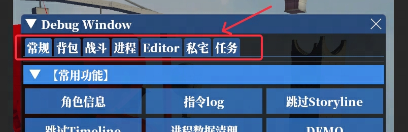
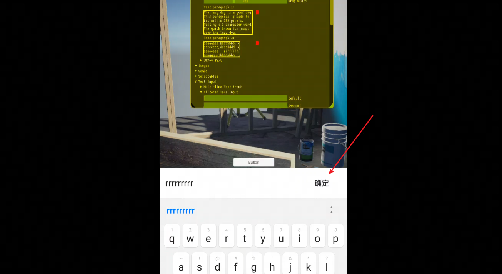
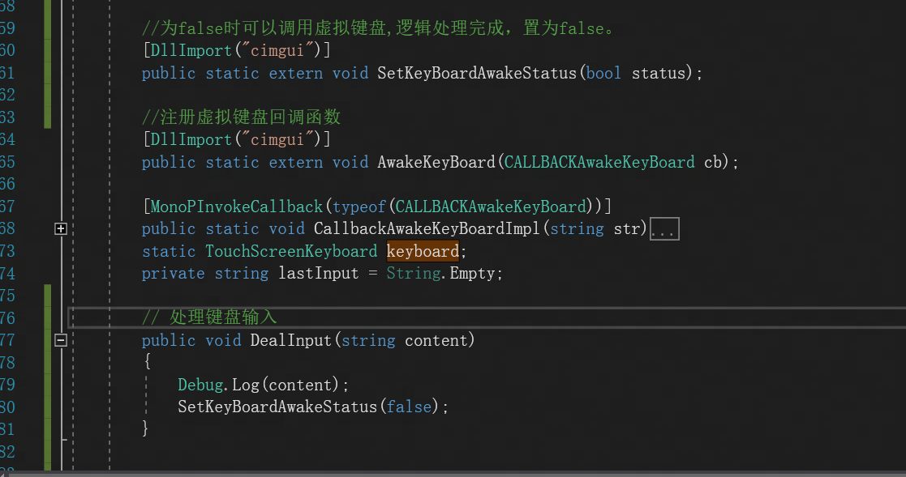
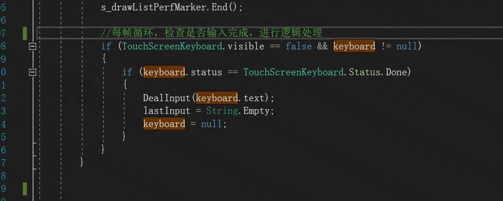
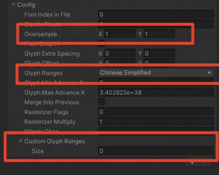
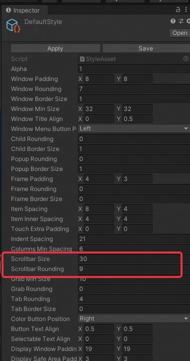

[toc]
# NativeImgui
Unity跨平台imgui插件，用于debug界面,能方便得创建UI界面
原插件地址
https://github.com/realgamessoftware/dear-imgui-unity-dev
该插件未进行android和IOS的尝试，本库进行了补充了。可以方便的接入unity

## fix：
### 1.修复ios界面紫色的问题（shader编译优化导致）
### 2.修复android和IoS不能弹出虚拟键盘的问题

  点击text界面，出现斜杠(表示focus),然后弹出键盘， 输入完毕之后的 Text,在unity层会获取到，然后传给脚本层，用ImGui::InputText 把这个text画出来
### 3.若本地字体内存过大，参考设置如下：

### 4.若窗口大小无法调节
   Imgui::SetNextWindowSize(size,ImGuiCond.Always) 
### 5.修复IOS Tab界面需要双击才能切换的问题
### 6.滑动条在移动端很难选中的问题
修改滑动条宽度
